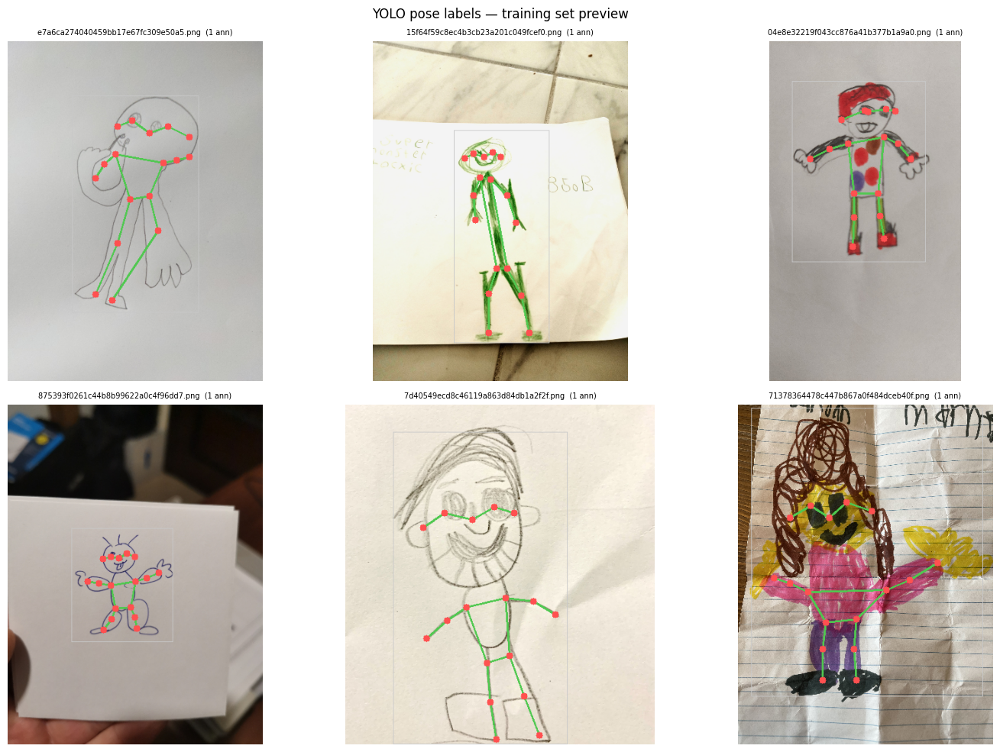
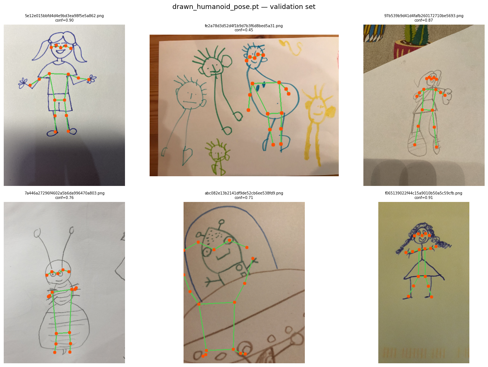

# Training: YOLOv8-pose on Amateur Drawings

Fine-tunes `yolov8n-pose.pt` on the [Amateur Drawings Dataset](https://ai.meta.com/blog/ai-dataset-animation-drawings/)
([AnimatedDrawings](https://github.com/facebookresearch/AnimatedDrawings), 178 000 annotated drawn humanoids, COCO-17 keypoints, MIT license).

---

## Option A — Local training

```bat
REM 1. Download annotations (~275 MB) + subset of images
.venv\Scripts\python 1_download_dataset.py

REM 2. Convert COCO JSON → YOLO pose labels
.venv\Scripts\python 2_prepare_yolo.py

REM 3. Train (CPU smoke-test)
.venv\Scripts\python 3_train.py --epochs 3 --batch 4 --device cpu

REM 3. Train (GPU full run)
.venv\Scripts\python 3_train.py --epochs 50 --batch 16 --device 0
```

### Options

| Script | Key flags | Default |
|--------|-----------|---------|
| `1_download_dataset.py` | `--train-count`, `--val-count` | 3000 / 500 |
| `3_train.py` | `--epochs`, `--batch`, `--imgsz`, `--device` | 50 / 16 / 640 / 0 |

### Notes

- CPU-only: ~12–24 h for 50 epochs on 3000 images. Use `--epochs 3` to verify the pipeline.
- GPU: ~30–60 min for 50 epochs on a modern card.
- Dataset images are downloaded individually (only the subset you need, not 50 GB).

---

## Option B — Google Colab via `colab_from_drive.ipynb` (data from Google Drive)

Trains on Colab using data pre-packaged locally and uploaded to Google Drive.
Avoids downloading 50 GB inside Colab; total transfer is ~930 MB.

### Step 1 — Prepare data locally

Run steps 1 and 2 from Option A first (downloads images and generates YOLO labels):

```bat
.venv\Scripts\python 1_download_dataset.py
.venv\Scripts\python 2_prepare_yolo.py
```

This creates:

```
data/
  images/train/   ← 3000 images
  images/val/     ← 500 images
  labels/train/   ← YOLO pose .txt files
  labels/val/
```

### Step 2 — Pack `data.zip`

```bat
.venv\Scripts\python 2b_pack_colab_data.py
```

Optional flags:

| Flag | Default | Description |
|------|---------|-------------|
| `--data-dir` | `data` | directory with `images/` and `labels/` |
| `--out` | `data.zip` | output zip path |

The resulting `data.zip` should be ~930 MB.

### Step 3 — Upload to Google Drive

Place the zip at exactly this path in your Google Drive:

```
MyDrive/yolo_data/data.zip
```

### Step 4 — Open and run the notebook

1. Open [colab_from_drive.ipynb](colab_from_drive.ipynb) in Google Colab:
   - In Google Colab: **File → Upload notebook** and select the file, or
   - Push the file to GitHub and open via `colab.research.google.com/github/…`
2. Before running: **Runtime → Change runtime type → T4 GPU**
3. Run all cells top to bottom (**Runtime → Run all**).

The notebook will:
- Mount your Google Drive and copy `data.zip` to Colab (`/content/`)
- Extract images and pre-generated labels
- Train YOLOv8n-pose for 50 epochs (~30–60 min on T4)
- Export the best model to ONNX
- Download `drawn_humanoid_pose.pt` and `drawn_humanoid_pose.onnx` to your browser

Optionally, cell 6b saves the trained models back to `MyDrive/yolo_models/` so they survive a session reset.

### Output

Best weights: `/content/runs/drawn_humanoid_pose/weights/best.pt`  
ONNX export: `/content/runs/drawn_humanoid_pose/weights/best.onnx`

---

## Option C — Google Colab via `colab_from_meta.ipynb` (data from Meta directly)

Downloads the dataset directly from Meta inside Colab — no local preparation needed.

| Step | What happens |
|------|-------------|
| Cell 2 | Downloads annotations JSON (~275 MB) from Meta |
| Cell 3 | Downloads full tar (~50 GB, ~20–40 min) and **selectively extracts** only the 3500 needed images |
| Cell 4 | Generates YOLO pose labels inline |
| Cells 7–10 | Train → Export ONNX → Download models |

**Parameters** (edit at top of cell 2):

```python
TRAIN_COUNT = 3000
VAL_COUNT   = 500
```

**Before running:** `Runtime → Change runtime type → T4 GPU`, then `Runtime → Run all`.

---

## Model output

Best weights: `training/runs/drawn_humanoid_pose/weights/best.pt`

To use the trained model in `annotate_yolo.py`, pass the path to `best.pt` instead of `yolov8n-pose.pt`.

## Training Report

- **Environment:** Ultralytics 8.4.51, Python 3.12.13, torch 2.10.0+cu128, CUDA: Tesla T4 (14913 MiB).
- **Base model:** `yolov8n-pose.pt` (YOLOv8n-pose, ~3.3M parameters, ~9.3 GFLOPs).
- **Dataset:** ~3000 train images, ~500 val images (validation instances reported: 495).
- **Training schedule:** 50 epochs, batch=16, imgsz=640, AMP enabled, pretrained weights transferred, one layer partially frozen, `auto` optimizer → AdamW (lr≈0.002, weight_decay=0.0005).
- **Augmentations:** `randaugment` (auto_augment), mosaic enabled early, albumentations applied (Blur, MedianBlur, ToGray, CLAHE, p=0.01).
- **Best validation results (from `/content/runs/drawn_humanoid_pose/weights/best.pt`):**
  - **Box:** Precision=0.921, Recall=0.937, mAP50=0.956, mAP50-95=0.771
  - **Pose:** Precision=0.944, Recall=0.933, mAP50=0.956, mAP50-95=0.722
- **Runtime / artifacts:** 50 epochs completed in ~0.934 hours. `last.pt` and `best.pt` saved (optimizer stripped, ~6.8 MB). ONNX export available as `best.onnx`.

### Example previews

Training labels preview (examples):



Validation predictions preview (model `drawn_humanoid_pose.pt`):



These images show typical ground-truth keypoint labels (left) and model pose predictions on validation images (right).

---

## Visualize ground-truth labels

`visualize_labels.py` draws YOLO pose annotations on training or validation images.

```bat
.venv\Scripts\python visualize_labels.py
.venv\Scripts\python visualize_labels.py --split val -n 4
.venv\Scripts\python visualize_labels.py --out preview.png
```

| Argument | Default | Description |
|---|---|---|
| `--split` | `train` | `train` or `val` |
| `-n` | `6` | Number of images to show |
| `--out` | — | Save path instead of displaying |
| `--seed` | — | Random seed for reproducible sampling |

---

## Visualize predictions

`predict_visualize.py` runs inference with `drawn_humanoid_pose.pt` (or `.onnx`) on a folder of images
and displays detected poses in the same style as the ground-truth label visualizer.

```bat
REM Show 6 random val images (default model: drawn_humanoid_pose.pt)
.venv\Scripts\python predict_visualize.py --images data/images/val

REM More images, higher confidence threshold, save to file
.venv\Scripts\python predict_visualize.py --images data/images/val -n 9 --conf 0.25 --out result.png

REM Use ONNX model
.venv\Scripts\python predict_visualize.py --model drawn_humanoid_pose.onnx --images data/images/val
```

| Argument | Default | Description |
|---|---|---|
| `--model` | `drawn_humanoid_pose.pt` | Path to `.pt` or `.onnx` model |
| `--images` | — | Folder with input images |
| `-n` | `6` | Number of images to show |
| `--conf` | `0.01` | Confidence threshold |
| `--seed` | — | Random seed for reproducible sampling |
| `--out` | — | Save path instead of displaying |
